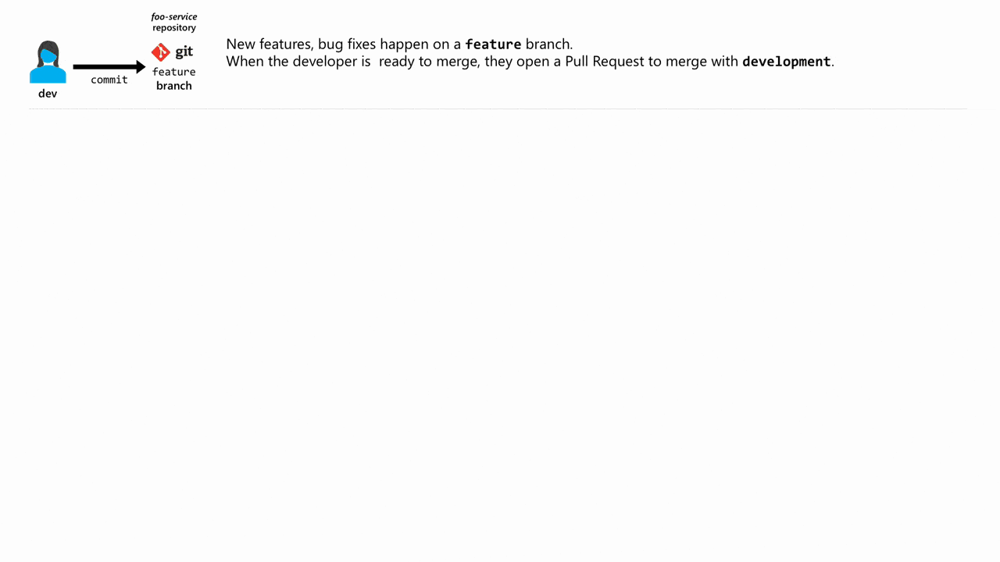
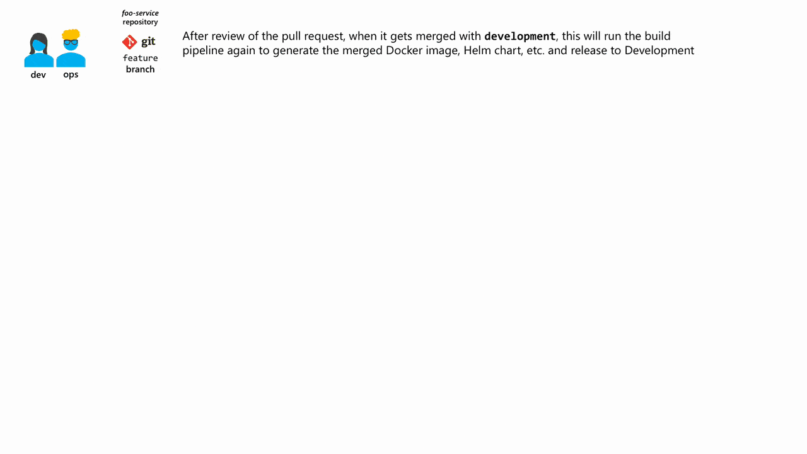
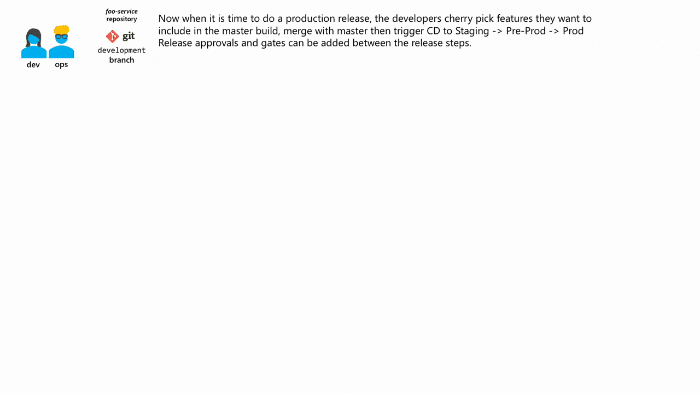

# Example guidance on setting up a Git driven AKS deployment pipeline

This is intended as a demo/guide on how to create a Git driven Azure Kubernetes Service (AKS) deployment pipeline.

## What is this

When it comes to setting up a Continuous Integration/Continuous Delivery pipeline for Kubernetes, there are many tutorials and opinions that exist in the community.

This repository is yet another opinionated way of setting this up, that's to say, there are surely better/smarter ways to do this, and you might not agree to this pipeline. Not all of the below might be applicable to your project and feel free to adapt it to your needs.

Many of the ideas presented here are a combination of what others have done, including [Weaveworks](https://www.weave.works/blog/gitops-operations-by-pull-request) and [Jenkins X](https://jenkins.io/blog/2018/03/19/introducing-jenkins-x/) but are adopted to use Microsoft Azure native services such as [Team Services](https://www.visualstudio.com/team-services/).

 I'm open to discussion and feedback so please open an issue if you need to discuss.

## Project structure

    .
    ├── code-repos                     # Container for Git submodules for standalone services/apps
    │   ├── foo-service                # Git submodule for a foo service
    │   │   ├── code                   # Source Code and Dockerfile for foo service
    │   │   ├── config                 # Kubernetes config/Helm Charts for foo service
    │   ├── bar-service                # Git submodule for a bar service
    ├── infrastructure                 # ARM templates to provision required Azure infrastructure
    │   ├── scripts                    # Helper scripts to deploy infrastructure
    ├── LICENSE
    └── README.md

## Some background on design choices

### Why this project structure

There are some distinct features of this folder structure:

1. Using separate Git repositories per microservice/app and linking them all to the main repository (this one) using Git submodules

    > Allows you to have cleaner build pipelines per service without having to fiddle around with path filters in order to build only a specific folder when changes show up there. There are two schools here; mono repository and multiple repository. I chose the latter, but feel free to read and [make](https://medium.com/@somakdas/code-repository-for-micro-services-mono-repository-or-multiple-repositories-d9ad6a8f6e0e) [your](http://blog.shippable.com/our-journey-to-microservices-and-a-mono-repository) [own](http://www.gigamonkeys.com/mono-vs-multi/) choice.

1. For each microservice/app, use a single Git repositoy for code and config

    > This keeps the pipeline simple because the build pipeline can bake the Helm chart corresponding to that new piece of code. A parallel build pipeline will also be created with a path filter targeting the config folder only to allow for the scenario to update the Helm chart without updating the Docker image.

1. Use Infrastructure as Code to provision the cluster and related artifacts

    > In the `infrastructure` folder, there are a bunch of Azure Resource Manager (ARM) templates that can be used to stand-up and update the infrastructure required (Kubernetes cluster, Azure Container Registry, Virtual Networks, etc.). In general, that is a good practice because it allows you to treat your infrastructure as cattle. If tomorrow you need to spin up in a new Azure region, you can do so easily. If you go the extra mile and setup a Continuous Delivery pipeline on this folder, you can ensure that no infrastructure configuration drift can happen.

## Pipeline flow

Developers work on their `feature` branches then they submit a Pull Request to the `development` branch.

The pull request will trigger a build, test and create preview tagged Docker images and Helm chart with the pull request ID, which will get released to a temporary Kubernetes namespace.



After review of the pull request, when it gets merged with the `development` branch. This will run the build pipeline again to generate the merged Docker image, Helm chart, etc. and release to `Development` environment.



Now when it is time to do a production release, the developers cherry pick features they want to include in the master build, merge with `master` then trigger CD to `Staging` -> `Pre-Prod` -> `Prod`.



Release approvals and gates can be added between the release steps for governance.

## Guide

This is split into smaller guides, so as to keep the size of this page manageable.

- [Provision the infrastructure](_docs/provision-infrastructure.md)
- [Creating a new service/config and general Git flow work with Git and pull requests](_docs/add-service-and-config-github.md)
- [Setting up CI/CD pull request pipeline](_docs/cicd-pullrequest-pipeline.md) (work in progress)
- [Setting up CI/CD service code and/or config pipeline](_docs/cicd-codeandconfig-pipeline.md) (work in progress)
- [Demo (testing the pipeline workflow)](_docs/demo.md) (work in progress)

## Areas of improvement

This space is rapidly moving and new tools and best practices keep popping up. The intention is to try and keep this up to date and as relevant as possible.

Below is an unordered checklist of areas I think could be improved/augmented in this pipeline:

- [ ] Document the *inner loop* of the developer's experience and integrate [Azure Dev Spaces](https://docs.microsoft.com/en-us/azure/dev-spaces/azure-dev-spaces)

- [ ] "ChatOps"..Slack or Microsoft Teams integration

- [ ] Add container security scanning solutions into the pipeline ([clair](https://github.com/coreos/clair), [anchore](https://anchore.freshdesk.com/support/solutions/articles/36000060726-installing-anchore-using-helm), [microscanner](https://github.com/aquasecurity/microscanner))

- [ ] Pulling secrets from Azure Key Vault and [injecting them during the release pipeline](https://docs.microsoft.com/en-us/vsts/build-release/concepts/library/variable-groups?view=vsts)

- [ ] How to do integration testing?

- [ ] Provision the infrastructure using ARM templates in the `infrastructure` folder

## Cloning this repository

This repository uses [submodules](https://github.com/blog/2104-working-with-submodules).

Git expects us to explicitly ask it to download the submodule's content. You can use `git submodule update --init --recursive` here as well, but if you're cloning this repository for the first time, you can use a modified clone command to ensure you download everything, including any submodules:

```sh
git clone --recursive git@github.com:sabbour/aks-gitops.git
```
