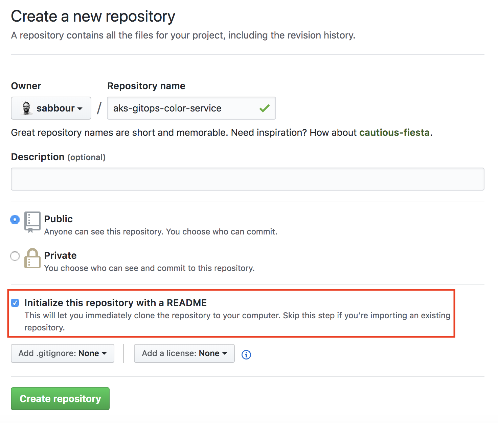
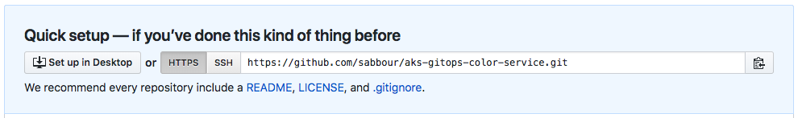

# Adding a new service and config

1. [Create](https://github.com/new) a new Github repository for the service. Make sure to check the "Initialize with README" option to be able to clone this repo locally immediately
    

2. Add the new repository as a submodule using the Git clone URL into the `code-repos` folder
    

    > **Example:** `git submodule add https://github.com/sabbour/aks-gitops-color-service.git code-repos/color-service`

**Do the same for the configuration repositories:**

1. [Create](https://github.com/new) a new Github repository for the service. Make sure to check the "Initialize with README" option to be able to clone this repo locally immediately

2. Add the new repository as a submodule using the Git clone URL into the `config-repos` folder

    > **Example:** `git submodule add https://github.com/sabbour/aks-gitops-color-service-config.git code-repos/color-service-config`