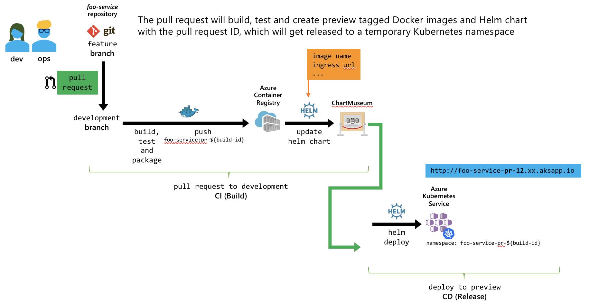
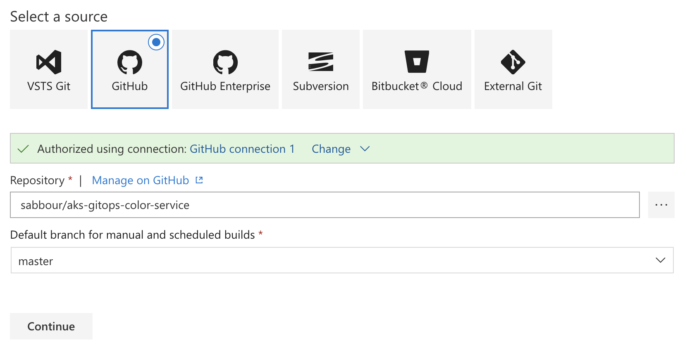
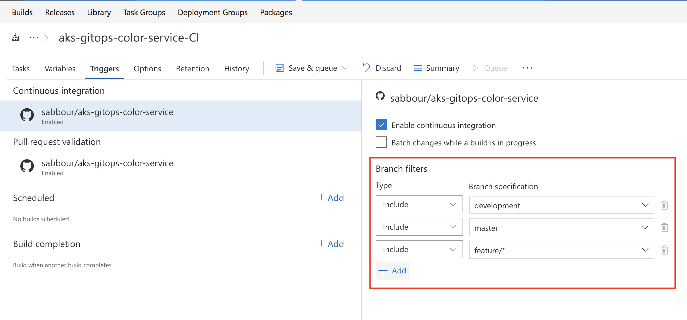
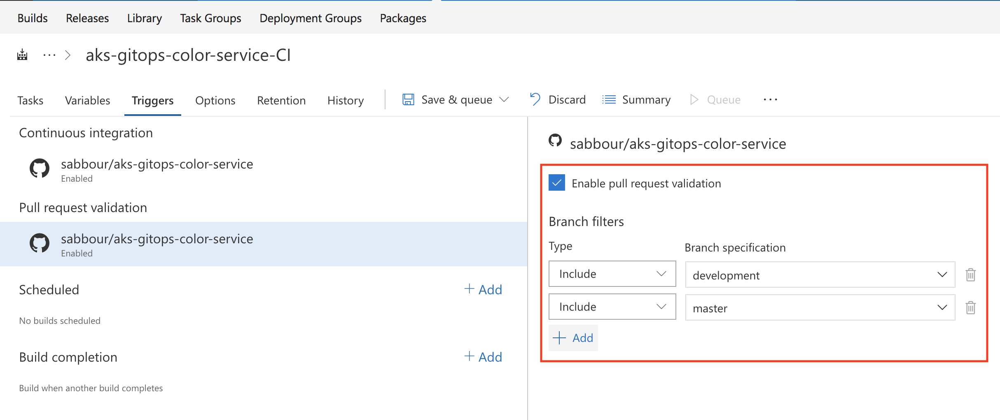
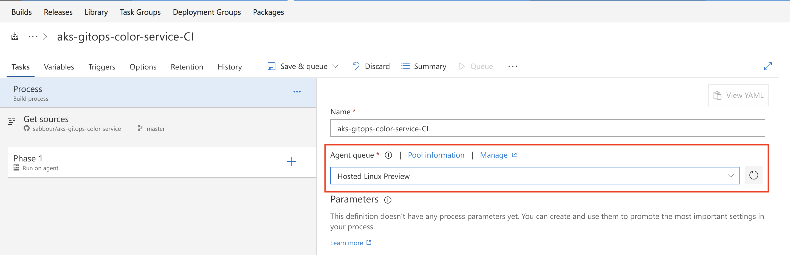

# Setting up the Pull Request pipeline

What you want to accomplish is that, for each Pull Request for `foo-service`:

- A Docker image is built and tagged as `foo-service:pr-<build id>`
- A Kubernetes namespace is created for the PR as `foo-service-pr-<build id>`
- The Helm chart is updated with values related to this PR (image name, ingress hostname, ..)
- The Helm chart is deployed

Once you have this pipeline run, then you can verify the service is deployed at a hostname similar to `foo-service-pr-12.xx.aksapp.io`.

Create a new **Build Definition**, pointing at your microservice repository.

For the **default branch**, this is the branch that you want to be the default when you manually queue this build. If you set a scheduled trigger for the build, this is the branch from which your build will get the latest sources. **The default branch has no bearing when the build is triggered through continuous integration (CI)**. Usually you'll set this to be the same as the default branch of the repository (for example, "master").

Setup the continuous integration triggers to trigger the build on `master`, `development` and `feature/*` branches.

Configure pull request validation on on `master`, `development`. This will trigger a build when a developer creates a pull request from their feature branch into `development` and when a pull request is created from `development` to `master`.

Optional but recommended, change the build agent queue to be **Hosted Linux Preview**.

Start adding the tasks, starting with Docker to build the image.

$(Build.SourceBranchName)-$(Build.Reason)-$(Build.SourceVersion)-$(Rev:.r)
master-IndividualCI-3sdr3-1
